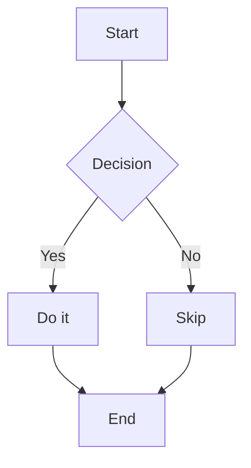

# Markdown 样式全量示例

用于调试 Markdown 渲染与 CSS 样式（包含 GFM、语法嵌套、原生 HTML、代码块、表格、脚注等）。

---

## 1. 标题层级（H2）

### 1.1 标题（H3）

#### 1.1.1 标题（H4）

##### 1.1.1.1 标题（H5）

###### 1.1.1.1.1 标题（H6）

同名标题测试（用于 slug / 锚点样式）：

### 重复标题

### 重复标题

---

## 2. 文本样式与混合嵌套

普通文本、中文 English 混排、数字 12345、符号 !@#$%^&\*()。

- 斜体：_italic_
- 粗体：**bold**
- 删除线：~~strikethrough~~
- 行内代码：`const answer = 42;`
- 混合嵌套：**粗体里有 _斜体_ 和 `code`，以及 [链接](https://example.com)**
- 自动链接（GFM）：https://example.com/path?query=1#hash
- 转义字符：\* \_ \~ \` \| \# \[ \] \( \)

换行测试（同一段落内的硬换行）  
上一行末尾有两个空格。

段落间距测试：下面是一段较长文本，用于观察行高、字间距、段落间距、最大宽度与断行策略（尤其是英文长单词与 URL 的折行）。

SupercalifragilisticexpialidociousSupercalifragilisticexpialidociousSupercalifragilisticexpialidocious

---

## 3. 引用（含嵌套）

> 一级引用：引用中可以包含 **加粗**、_斜体_、`inline code`、以及链接 [Example](https://example.com)。
>
> > 二级引用：嵌套引用文本。
> >
> > - 引用内列表项 A
> > - 引用内列表项 B（包含 `code` 与 ~~删除线~~）
> >
> > ```ts
> > type User = { id: string; name: string };
> > const u: User = { id: '1', name: 'Alice' };
> > ```
>
> 引用内结尾段落。

---

## 4. 列表（无序 / 有序 / 任务 / 混合）

### 4.1 无序列表（含深层嵌套）

- 一级 A
    - 二级 A-1
        - 三级 A-1-a：包含 **强调**、`code`、以及 [链接](https://example.com)。
        - 三级 A-1-b：包含一段很长的文本，用于观察列表项的换行缩进对齐是否正确，尤其在移动端窄屏下是否仍然易读。
    - 二级 A-2
- 一级 B
    - 二级 B-1
        1. 混合：二级下的有序列表 1
        2. 混合：二级下的有序列表 2
            - 再嵌套：无序项
            - 再嵌套：无序项
        3. 混合：二级下的有序列表 3

### 4.2 有序列表（含 start / 嵌套）

3. 从 3 开始的有序列表
4. 第二项
5. 第三项
    1. 嵌套有序 1
    2. 嵌套有序 2
        - 嵌套无序 a
        - 嵌套无序 b

### 4.3 任务列表（GFM）

- [x] 已完成任务：渲染复选框样式
- [ ] 未完成任务：hover / focus / disabled 样式
    - [x] 子任务：对齐与间距
    - [ ] 子任务：长文本换行对齐

### 4.4 列表项为“其他语法块”（代码块 / 引用 / 表格 / 图片 / HTML）

- 列表项内包含多个段落（多行内容 + 硬换行）  
  这一行末尾有两个空格，所以这是同一段落里的换行。  
  同一列表项内的第三行，用于测试对齐。

    下面是同一列表项里的第二段（与第一段之间有空行），用于观察段落间距。

- 列表项内直接放代码块（fenced code，需要缩进）

    ```ts
    function sum(a: number, b: number) {
        return a + b;
    }

    console.log(sum(1, 2));
    ```

    代码块后还有一段文本，检查代码块与段落间的间距。
    - 列表项内的子列表 A
    - 列表项内的子列表 B（含 `inline code`）

- 列表项内直接放引用块（引用里再嵌套列表/代码）

    > 引用块第一段：包含 **bold**、_italic_、`inline`。
    >
    > 第二段（引用内多段落）：用于观察引用块的段落间距与缩进。
    >
    > - 引用内无序列表项 1
    > - 引用内无序列表项 2
    >
    > ```bash
    > echo "blockquote + code"
    > ```

- 列表项内包含表格（表格行需要缩进，避免被解析成独立表格）

    | Key | Value | Note              |
    | --- | ----: | ----------------- |
    | A   |     1 | **bold**          |
    | B   |   200 | `code`            |
    | C   |     3 | 第一行<br/>第二行 |

    表格后再补一段说明文字，检查表格与段落的间距。

- 列表项内包含图片与“说明文字”

    

    图片下方的说明：用于测试图片与文字的间距、最大宽度、圆角、阴影等样式。

- 列表项内嵌原生 HTML（rehype-raw）

      <div class="list-html">
          <p><strong>HTML 容器：</strong>用于测试列表项内 block 元素的 margin 折叠与对齐。</p>
          <details>
              <summary>HTML details（在列表项内）</summary>
              <p>details 内容段落：包含 <code>inline</code> 与 <a href="https://example.com" target="_blank" rel="noopener noreferrer">链接</a></p>
          </details>
      </div>

1. 有序列表项里以“引用块”开头（多行内容）

    > 这是有序列表项内的引用块第一段。
    >
    > 第二段：用于测试编号与引用块对齐。

2. 有序列表项里先放代码块，再放子列表

    ```json
    {
        "id": "123",
        "items": [
            { "name": "A", "value": 1 },
            { "name": "B", "value": 2 }
        ]
    }
    ```

    - 子项 1
    - 子项 2
        - 更深层子项 2-a
        - 更深层子项 2-b

---

## 5. 表格（GFM：对齐 / 代码 / 换行）

| 左对齐 | 居中 | 右对齐 | 含代码               | 含换行                           |
| :----- | :--: | -----: | -------------------- | -------------------------------- |
| Apple  |  1   |   9.99 | `inline`             | 第一行<br/>第二行（HTML 换行）   |
| Banana |  20  |   1000 | `a \| b`（转义管道） | 很长很长很长很长很长很长很长很长 |
| Cherry | 300  |   0.01 | **bold** + _italic_  | 末尾                             |

表格前后段落，用于观察 margin / overflow / 横向滚动策略。

---

## 6. 代码块（多语言 / 高亮 / 折行）

### 6.1 TypeScript

```ts
export interface ApiResponse<T> {
    code: number;
    message: string;
    data: T;
}

export const fetcher = async <T>(url: string): Promise<ApiResponse<T>> => {
    const res = await fetch(url, {
        headers: { 'Content-Type': 'application/json' },
    });
    if (!res.ok) throw new Error(`HTTP ${res.status}: ${res.statusText}`);
    return (await res.json()) as ApiResponse<T>;
};
```

### 6.2 Bash（长行溢出）

```bash
curl -X POST 'https://example.com/api/v1/very/very/very/very/very/very/long/path?foo=bar&baz=qux&token=NOT_A_REAL_TOKEN' \
  -H 'Content-Type: application/json' \
  -d '{"name":"Alice","roles":["admin","editor"],"meta":{"k":"v","nested":{"a":[1,2,3]}}}'
```

### 6.3 JSON

```json
{
    "title": "Markdown Example",
    "tags": ["gfm", "rehype-raw", "nested"],
    "enabled": true,
    "count": 123,
    "nullValue": null
}
```

### 6.4 Markdown（代码中再套 Markdown）

```md
> 引用

- 列表
    - `code`
      | a | b |
      | - | - |
      | 1 | 2 |
```

### 6.5 Mermaid（仅用于样式测试）



---

## 7. 图片 / 链接 / 引用式链接

行内链接：[OpenAI](https://openai.com) / [Example](https://example.com) / [相对链接](./markdown-example.md)

引用式链接：查看 [GFM][gfm-link] 与 [React Markdown][rm-link]。

[gfm-link]: https://github.com/remarkjs/remark-gfm
[rm-link]: https://github.com/remarkjs/react-markdown

图片（外链，含 title）：  


图片（小尺寸，测试对齐/行高）：  


---

## 8. 分隔线 / 换行 / 空行

上面到这里应当看到分隔线样式。

---

下面是连续空行测试：

空行之后的段落。

---

## 9. 脚注（GFM）

脚注示例：这里有一个脚注引用[^note-1]，以及另一个脚注[^note-2]。

[^note-1]: 这是脚注 1。包含 **加粗**、`code` 与链接 https://example.com 。

[^note-2]:
    这是脚注 2。  
    第二行（缩进 + 硬换行）。

- 脚注内也可以放列表项
- 以及更多文本

---

## 10. 原生 HTML（rehype-raw）

下面是一些原生 HTML 标签，用于测试重置样式与排版边距。

<div class="callout">
  <strong>Callout：</strong>
  <span>这是一个带 class 的 div，用于测试容器边框、背景、内边距与行高。</span>
</div>

<details>
  <summary>折叠面板（details/summary）</summary>
  <p>面板内容段落：包含 <code>inline code</code>、<a href="https://example.com" target="_blank" rel="noopener noreferrer">链接</a>。</p>
  <ul>
    <li>HTML 列表项 1</li>
    <li>HTML 列表项 2（含 <kbd>kbd</kbd>、<mark>mark</mark>、<sup>sup</sup>、<sub>sub</sub>）</li>
  </ul>
</details>

<blockquote>
  <p>HTML blockquote（与 Markdown blockquote 对比）</p>
</blockquote>

<table>
  <thead>
    <tr>
      <th>HTML 表头 1</th>
      <th>HTML 表头 2</th>
    </tr>
  </thead>
  <tbody>
    <tr>
      <td>单元格 A</td>
      <td>单元格 B</td>
    </tr>
    <tr>
      <td><code>&lt;code&gt;</code> inside</td>
      <td><a href="https://example.com" target="_blank" rel="noopener noreferrer">外链</a></td>
    </tr>
  </tbody>
</table>

---

## 11. 复杂嵌套综合场景

1. 有序列表项内含引用与子列表：
    > 引用块里再含无序列表：
    >
    > - 子项 1（含 `code`）
    > - 子项 2（含 ~~删除线~~）
    >
    > 以及一个代码块：
    >
    > ```tsx
    > export default function Button() {
    >     return <button type="button">Click</button>;
    > }
    > ```
2. 同一列表项内含表格（用于观察缩进与 overflow）：

    | Key | Value |
    | --- | ----- |
    | A   | 1     |
    | B   | 2     |

3. 同一列表项内含原生 HTML 容器：

 <div class="nested-box">
   <p>这是嵌套在列表项中的 HTML 容器。</p>
   <p>用于测试列表项内的 block 元素 margin 折叠与间距。</p>
 </div>

---

## 12. 末尾收尾

最后一段：用于观察 article 容器 padding、最大宽度、以及默认字体与颜色方案。

---

## 13. 列表项内的“段落 + 子块”组合（常见排版坑）

- 列表项包含多个段落（用于测试列表项段落间距与缩进对齐）：

    第一段：这是列表项内的第一段文本。包含 **强调**、`inline`、以及 [链接](https://example.com)。

    第二段：同一列表项内的第二段文本，应该保持与 bullet 对齐的缩进规则。

    ```css
    .listItem {
        padding-left: 1rem;
        line-height: 1.7;
    }
    ```

    - 列表项内再嵌套列表（用于测试多层缩进）
        - 再下一层

- 另一个列表项：后面紧跟一个引用块（用于测试 margin 折叠）

    > 列表项内的 blockquote：包含任务列表与表格。
    >
    > - [x] 引用内任务 1
    > - [ ] 引用内任务 2
    >
    > | 引用内表格 |  值 |
    > | ---------- | --: |
    > | A          |   1 |
    > | B          |   2 |

---

## 14. 引用中的“标题 + 列表 + 代码 + HTML”混排

> ### 引用中的标题（H3）
>
> 引用段落：**粗体**、_斜体_、~~删除线~~、`code`，以及自动链接 https://example.com。
>
> 1. 引用内有序列表
>     - 引用内无序子项
>         - 更深层子项（测试圆点样式与间距）
>
> ```tsx
> export function Card(props: { title: string; children: React.ReactNode }) {
>     return (
>         <section className="card">
>             <h3>{props.title}</h3>
>             <div className="content">{props.children}</div>
>         </section>
>     );
> }
> ```
>
> <div class="quote-html">
>   <p>引用里嵌 HTML：<strong>strong</strong>、<em>em</em>、<code>code</code></p>
> </div>

---

## 15. 复杂表格：内嵌格式、脚注、链接与长内容

| 场景         | 示例                                                                   | 备注                |
| ------------ | ---------------------------------------------------------------------- | ------------------- |
| 强调与代码   | **bold** / _italic_ / `code`                                           | 观察行高与 baseline |
| 链接与删除线 | [link](https://example.com) + ~~del~~                                  | 观察 hover/visited  |
| 脚注引用     | 脚注在表格内[^table-note]                                              | 观察脚注样式与跳转  |
| 超长不换行   | `aaaaaaaaaaaaaaaaaaaaaaaaaaaaaaaaaaaaaaaaaaaaaaaaaaaaaaaaaaaaaaaaaaaa` | 观察 overflow       |
| 多行（HTML） | 第一行<br/>第二行<br/><span class="muted">第三行（带 class）</span>    | 观察行距            |

[^table-note]: 这是表格里的脚注定义。包含一段较长文字，用于观察脚注列表的排版与链接颜色。

---

## 16. 链接里的图片、图片里的链接（组合测试）

[](https://example.com)

<a href="https://example.com" target="_blank" rel="noopener noreferrer">
  
</a>

---

## 17. 原生 HTML：更复杂的结构（用于 CSS 选择器/层级）

<figure class="figure">
  
  <figcaption>Figcaption：<strong>说明文字</strong> + <code>inline code</code> + <a href="https://example.com" target="_blank" rel="noopener noreferrer">链接</a></figcaption>
</figure>

<div class="grid">
  <div class="grid__item">
    <h4>卡片 A</h4>
    <p>文本 <mark>mark</mark> <kbd>kbd</kbd> <sup>sup</sup> <sub>sub</sub></p>
  </div>
  <div class="grid__item">
    <h4>卡片 B</h4>
    <p><span class="tag">tag</span> <span class="tag tag--primary">tag--primary</span></p>
  </div>
  <div class="grid__item">
    <h4>卡片 C</h4>
    <p class="muted">muted 文本：用于测试次要文字颜色与字号。</p>
  </div>
</div>

<dl class="dl">
  <dt>术语 A</dt>
  <dd>解释 A：这是一段解释文本，用于测试 dt/dd 的间距与字体。</dd>
  <dt>术语 B</dt>
  <dd>
    解释 B：包含列表：
    <ul>
      <li>HTML 列表 1</li>
      <li>HTML 列表 2（含 <code>code</code>）</li>
    </ul>
  </dd>
</dl>

---

## 18. details 的多层嵌套（折叠组件样式）

<details class="details">
  <summary>第一层 summary（点击展开）</summary>
  <p>第一层内容段落：包含 <code>inline</code> 与 <a href="https://example.com" target="_blank" rel="noopener noreferrer">链接</a>。</p>
  <details class="details details--inner">
    <summary>第二层 summary（嵌套）</summary>
    <p>第二层内容段落：用于测试缩进、边框与背景。</p>
    <ul>
      <li>第二层列表项 1</li>
      <li>第二层列表项 2</li>
    </ul>
  </details>
</details>

---

## 19. 同一段落里混合 HTML 行内元素（baseline/line-height）

这行包含 <span class="pill">pill</span>、<span class="pill pill--danger">pill--danger</span>、<a href="https://example.com" target="_blank" rel="noopener noreferrer"><code>code-link</code></a>、以及 <small class="small">small 文本</small>，用于测试 baseline 对齐与 line-height。

---

## 20. 尾部压力测试：超长段落 + 多种内联样式连续出现

一段综合文本：**加粗** _斜体_ ~~删除线~~ `inline code` [链接](https://example.com) <span class="muted">HTML span</span> **再来一段 _嵌套斜体_ 与 `code`**，以及一个超长 URL https://example.com/this/is/a/very/very/very/very/very/very/very/very/very/very/long/path/with/a/lot/of/segments?and=query&params=too#hash 用于测试断行策略与溢出处理。
